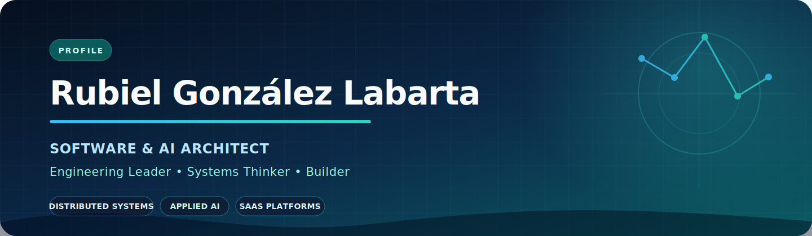

<div align="center">



### I turn ambitious product goals into scalable software, applied AI and reliable engineering execution.

Architecting **SaaS platforms, distributed systems and GenAI capabilities** for international teams across Europe and the Americas.

[](https://www.linkedin.com/in/rubiel-gonzalez-labarta/)
[](mailto:rubiel.labarta@gmail.com)
[](https://github.com/ralabarta?tab=repositories)

</div>

## The value I bring

<table>
<tr>
<td width="33%" valign="top">

### 🏗️ Architecture

I design secure, observable and maintainable **multi-tenant SaaS**, event-driven systems, APIs and cloud platforms using pragmatic DDD and Clean Architecture.

</td>
<td width="33%" valign="top">

### 🧠 Applied AI

I build **RAG systems, LLM agents and ML capabilities** for recommendation, prediction and anomaly detection - from experiment to production architecture.

</td>
<td width="33%" valign="top">

### ⚙️ Engineering leadership

I translate ambiguity into **technical strategy, roadmaps and delivery systems**, aligning product, engineering and business around explicit trade-offs.

</td>
</tr>
</table>

## Impact, not just output

<div align="center">

| **7+ years** | **18 modules** | **119 → 8** | **3 critical incidents** |
|:---:|:---:|:---:|:---:|
| Software architecture & leadership | White-label SaaS platform redesigned | Versioned requirements turned into an 8-sprint roadmap | Resolved and followed by stronger operational controls |

</div>

- Lead architecture and delivery for international client products at **Informage Studios**, combining full-stack engineering with applied AI/ML.
- Served as **interim CTO and Software Architect** at KameleonLabs, aligning product strategy, platform design and engineering governance.
- Created architecture decision frameworks, developer playbooks and implementation standards that make complex systems easier to build and operate.
- Taught software engineering, APIs, automated testing and data science/ML at the **University of Informatics Sciences**.

## Selected engineering evidence

<table>
<tr>
<td width="50%" valign="top">

### 🔎 Local-first RAG & semantic retrieval

**[gpt4all_embeddings](https://github.com/ralabarta/gpt4all_embeddings)**

A practical exploration of document ingestion, embeddings, vector search and source-grounded answers with LangChain, Chroma and local language models.

`Python` `LangChain` `Embeddings` `Vector Search` `LLMs`

</td>
<td width="50%" valign="top">

### ♟️ Alessandro chess engine

**[Technical publication](https://www.researchgate.net/publication/259781571_Alessandro_v10_Chess_Engine)**

An early applied-AI project combining search, evaluation and domain modelling - backed by published technical work and years of competitive chess practice.

`AI Search` `Algorithms` `C++` `Domain Modelling`

</td>
</tr>
<tr>
<td width="50%" valign="top">

### 🤖 Language-model experimentation

**[GPT4All model trainer](https://github.com/ralabarta/gpt4all_gptj_model_trainer)**

Hands-on experimentation with local language-model training workflows and the engineering constraints around data, compute and reproducibility.

`Python` `GPT-J` `LLMs` `Model Training`

</td>
<td width="50%" valign="top">

### 🏢 Production architecture

**Private and client work · case studies available in conversation**

Multi-tenant SaaS, event-driven services, GenAI workflows, CI/CD and production stabilization across products for teams in Spain, Estonia and the Americas.

`TypeScript` `NestJS` `Next.js` `Supabase` `PostgreSQL` `BullMQ`

</td>
</tr>
</table>

> My strongest commercial systems are private. I am happy to walk through the architecture, decisions, trade-offs and measurable outcomes without exposing confidential material.

## Technical range

<div align="center">

**Core engineering**


**Data, cloud & platform**


**Delivery & quality**


</div>

<details>
<summary><b>How I approach complex systems</b></summary>
<br>

```text
Business outcome
      ↓
Constraints & risks → Architecture decisions → Thin vertical slice
      ↓                       ↓                       ↓
Explicit trade-offs      Observable system      Evidence & feedback
      └─────────────────────── iterate ───────────────────────┘
```

I prefer evolutionary architecture: make the important decisions explicit, validate the riskiest assumptions early, instrument the system and preserve room to change.

</details>

## Beyond software

♟️ **2025 Cuban correspondence chess champion**, competing above a 2500 rating - a discipline that reinforces strategic thinking, deep analysis and decision-making under uncertainty.

📚 **Author of 20+ published books** in Cuba and Spain - experience that sharpens structured thinking, technical communication and the ability to make complex ideas clear.

🌍 Native Spanish · Professional English · Professional Portuguese · Remote from UTC-5

## Let's build something consequential

I am most valuable where **architecture, applied AI and engineering leadership intersect** - especially when a product needs clarity, a platform needs to scale or a team needs a stronger technical operating model.

Open to conversations around **Software / AI Architect, Staff–Principal Engineer, Tech Lead and Head of Engineering** opportunities.

<div align="center">

[](mailto:rubiel.labarta@gmail.com)

<sub>Architecture with intent · AI with evidence · Leadership with accountability</sub>

</div>
